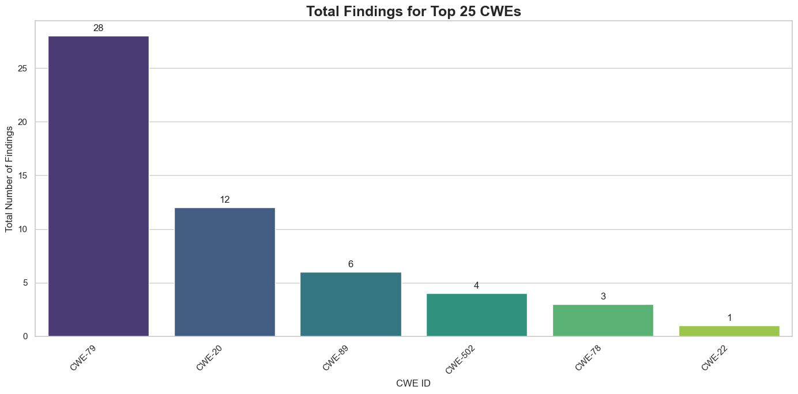
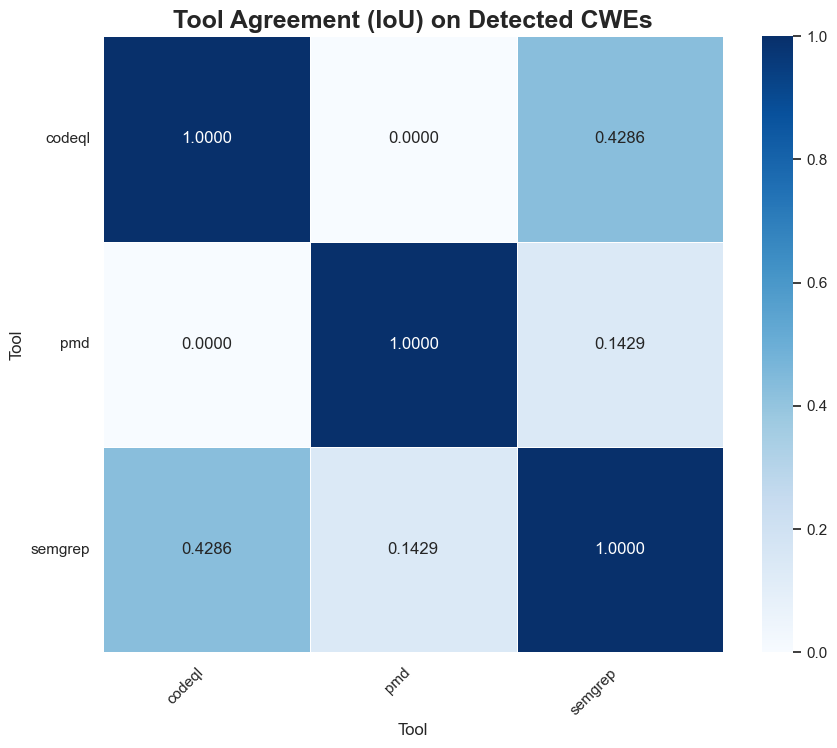

We got most of the data of (repository, tool) pair as 0 or 1. Hence for the purpose of meaningfully calculating IoU we use sample data.

PMD and CodeQL are the most diverse and complimentary SAST according to this data.